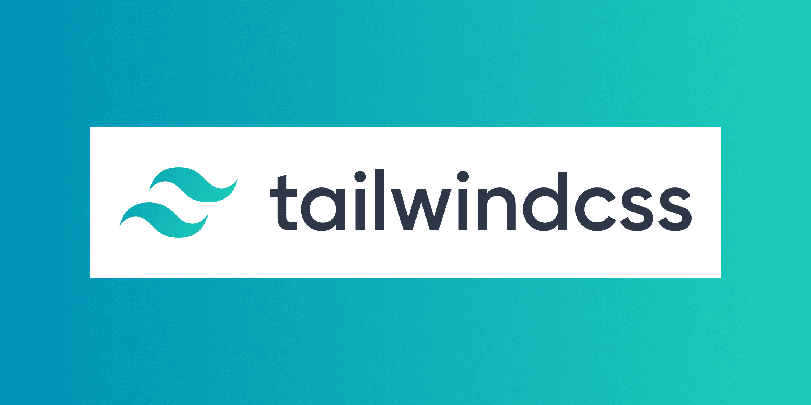
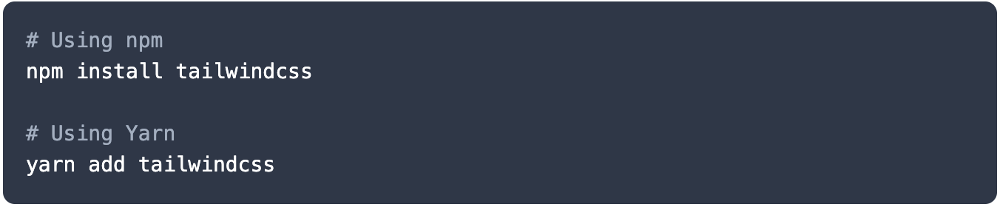
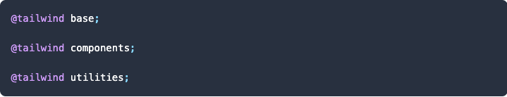
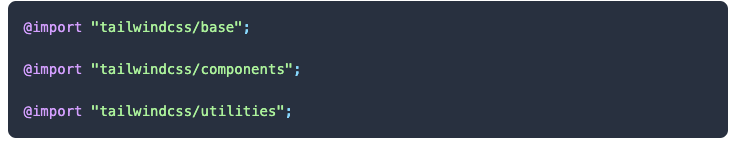
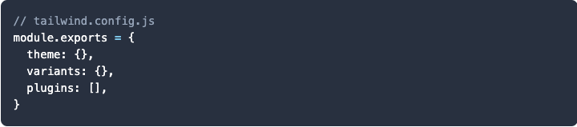
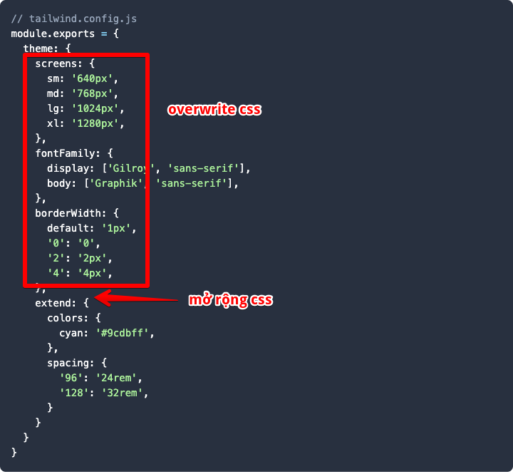
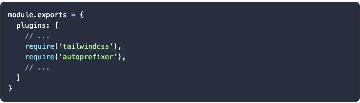
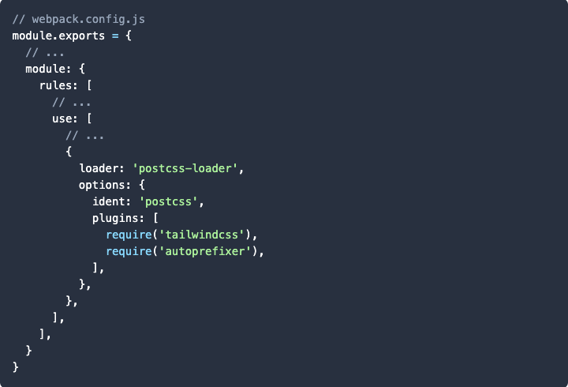

---

> Hello các bạn, welcome to blog Dâng đẹp trai =)). Bài viết hôm nay minh sẽ chia sẽ cho các bạn một thư viện để styling html, thư viện đó có tên là `tailwindcss`. Giống như các thư viên mà các bạn có thể đã từng nghe qua như `bootstrap`, ... Điểm khác biệt mà hay ở tailwind mà mình thấy là nó hổ trợ nhiều value cho một property và cho phép bạn overwrite hay extend một cách dễ dàng. VD như [`width`](https://tailwindcss.com/docs/width/#app)

#### Now, let's begin...........

# Installation

---

1. ## Add Tailwind to your CSS

- cài đặt giống như các node module khác, các bạn có thể dùng **`npm`** hoặc **`yarn`**

2. ## Add Tailwind to your CSS

   sau khi cài đặt, chúng ta import vào project bằng cách tạo 1 file css và inject **`Tailwind`** vào. Tailwind sẽ định nghĩa toàn bộ css mà mình cần, và chúng ra cũng có thể **`overwrite`** hoặc **`extend`**, lát nữa mình sẽ hướng dẫn các bạn cái này.

   

   Nếu bạn đang sử dụng **`postcss-import`** chúng ta có thể dùng **`@import`** để thay thế cho **`@tailwind`**.

   

3. #### Create your Tailwind config file

   Tạo file **`tailwind.config.js`** :

   

   Để mình giải thích chổ này cho các bạn,

   - **`theme`** là nơi các bạn overwrite hoặc extend các css

     

   - varitants là nơi bạn định nghĩa các effect chi các class css của bạn hay con gọi là CSS Pseudo-classes. Tailwind hổ trợ **`hover, focus, active, disabled, visited, first-child, last-child, odd-child, even-child, group-hover, focus-within`**. Tham khảo link

   - **`plugins`** cho phép bạn thêm những third-party plugins của tailwind. Tham khảo [link](https://tailwindcss.com/docs/plugins/)

   #### Tham khảo thêm tại đây [link](https://tailwindcss.com/docs/configuration/)

4. #### Build tailwind với Webpack

   Phổ biến nhất trong các project, dùng tailwind như một PostCSS plugin. - - Tạo file **`postcss.config.js`**

   

   Tham khải về postcss tại đây. [link](https://github.com/postcss/postcss#usage)

   ... hoặc bạn có thể thêm postcss-loader vào **`webpack.config.js`**

   
