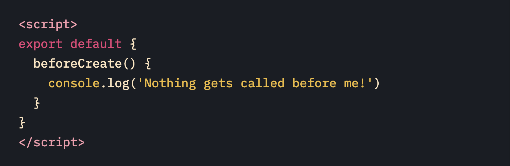
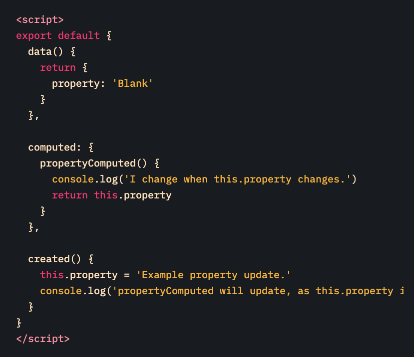
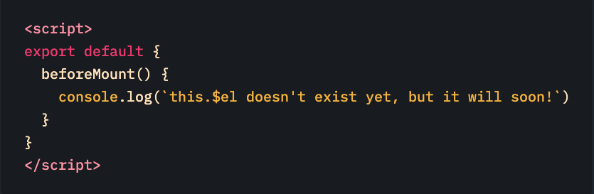
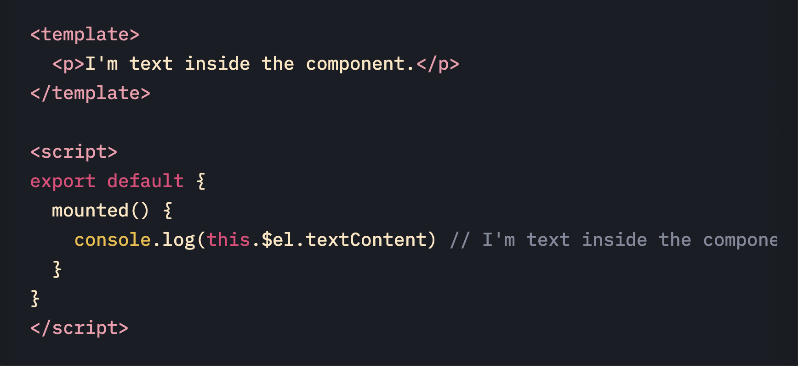
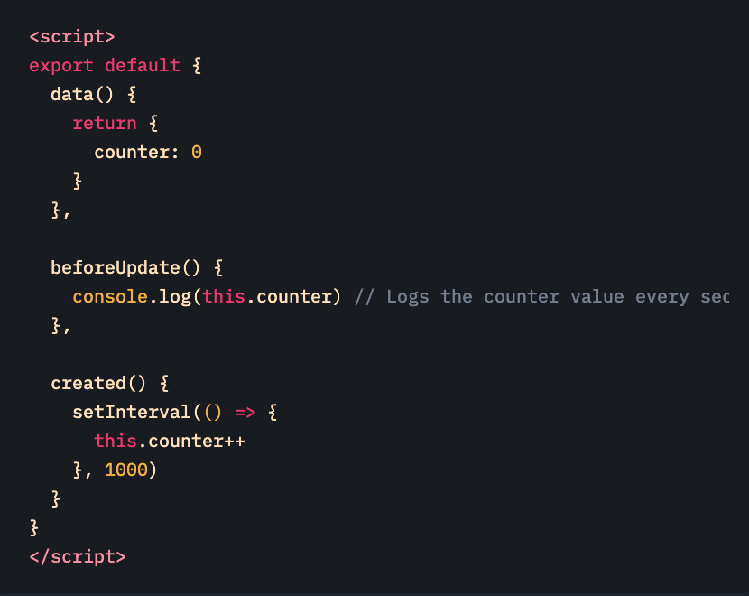
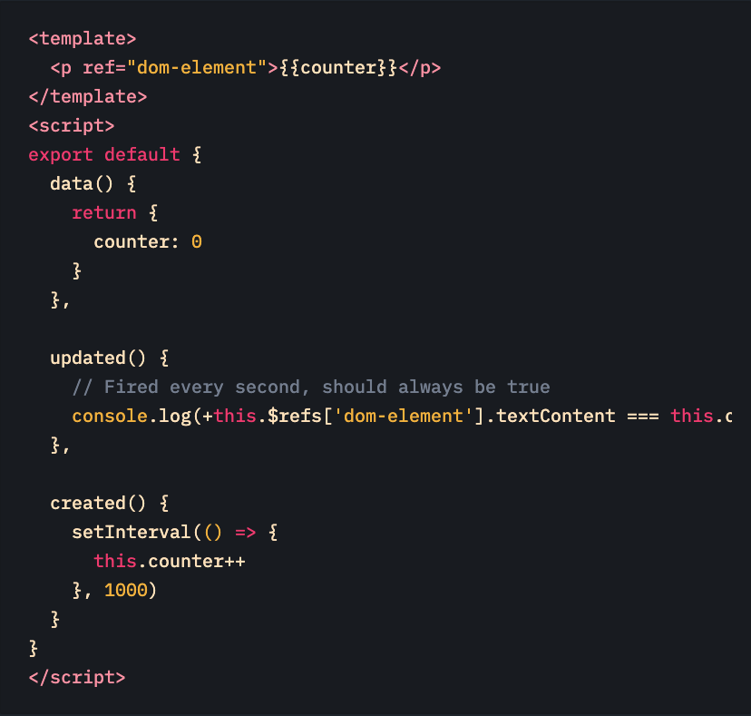
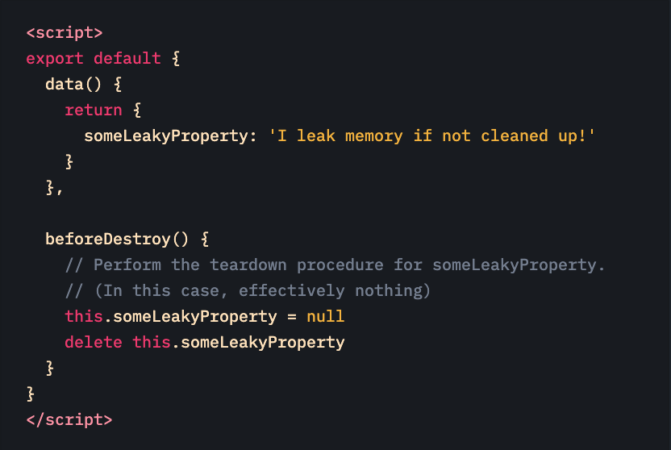
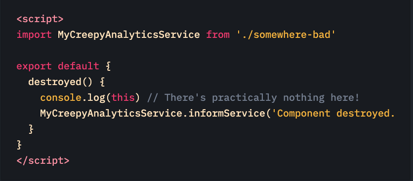

# Creation (Initialization)

- **Creation** hooks chạy đầu tiên khi trước khi khởi tạo component và thêm vào **DOM**
- **creation** hooks có thể chạy **SRR**(server-side rendering) và **CSR** (client-side rendering)
- Bạn không thể truy cập vào **this.\$el** vì component chưa khỏi tạo và add vào **DOM**

# beforeCreate

- khởi tạo component nhưng chưa được access vào **data** và **events**

# created

- Trong `created` hook, có thể access vào data và events nhưng mà component chưa được `mounted` hoặc `rendered`

# Mounting (DOM Insertion)

- Mounting hooks thường được sử dụng nhiều nhất. Mounting cho phép bạn access vào component trước và sau component render lần đầu tiên.
- `Nên dùng mounting hook` nếu như bạn cần access hoặc sửa DOM của component trước hoặc sau khi render
- `Không nên dùng mounting hook` nếu như bạn cần get data cho component của bạn. Nên dùng `created` get data để thay thế cho mounting hook. `especially if you need that data during server-side rendering.`

# beforeMount

- beforeMount hook chạy trước khi render component. Hầu như bạn sẽ không cần sử dụng hook này.

- Remember, it doesn’t get called when doing server-side rendering.

# mounted

- `mounted` hook, bạn sẽ có full quyền để access vào component, templates và rennder DOM (this.\$el)
- `mounted` hook được dùng thường xuyên và phổ biến nhất, thường được dùng để fetch data cho component của bạn (có thể dùng `created`)
- `mount` bạn có thể sửa DOM

# Updating (Diff & Re-render)

- `Updating` hooks sẽ được gọi bất cứ khi nào component bạn thay đổi hoặc component re-render. `Updating` cho phép bạn hook vào `watch-compute-render`.
- nếu dùng `Updating` thì bạn nên biết khi nào component re-render.
- không nên dùng nếu như bạn không biết về property của componrnt khi nào thay đổi (có thể dùng `computed` hoặc `watchers` để thay thế).

# beforeUpdate

# updated

# Destruction (Teardown)

# beforeDestroy

# destroyed

# other Hooks

- `activated`
- `deactivated`
